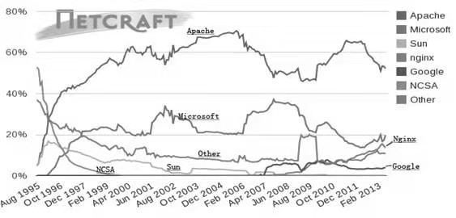

# 常见服务器产品介绍

我们仍然以Netcraft公布的数据为基础，对常见主流服务器产品进行介绍。图1.1摘自Netcraft官方网站，其展示了2012年全球主流Web服务器的市场份额情况，其中有Apache、Microsoft IIS、Sun、Nginx、Google以及NCSA等。在接下来的各小节中，我们主要针对Apache、Microsoft IIS、NCSA等Web服务器产品进行介绍，同时还将补充介绍图中未提及的Tomcat、Lighttpd等Web服务器产品。

图1.1 全球主流Web服务器市场份额（2012, 来源：Netcraft）