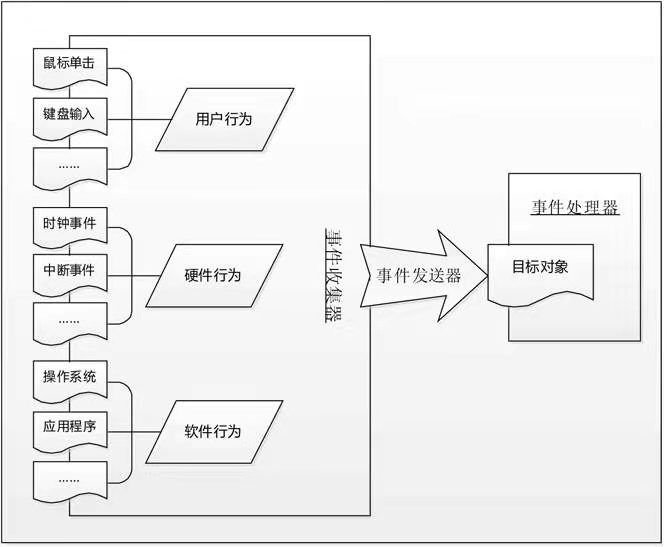

# 事件驱动模型概述

实际上，事件驱动并不是计算机编程领域的专业词汇，它是一种比较古老的响应事件的模型，在计算机编程、公共关系、经济活动等领域均有很广泛的应用。顾名思义，事件驱动就是在持续事务管理过程中，由当前时间点上出现的事件引发的调动可用资源执行相关任务，解决不断出现的问题，防止事务堆积的一种策略。在计算机编程领域，事件驱动模型对应一种程序设计方式，Event-driven programming，即事件驱动程序设计。

如图3.1所示，事件驱动模型一般是由事件收集器、事件发送器和事件处理器三部分基本单元组成。

其中，事件收集器专门负责收集所有的事件，包括来自用户的（如鼠标单击事件、键盘输入事件等）、来自硬件的（如时钟事件等）和来自软件的（如操作系统、应用程序本身等）。事件发送器负责将收集器收集到的事件分发到目标对象中。目标对象就是事件处理器所处的位置。事件处理器主要负责具体事件的响应工作，它往往要到实现阶段才完全确定。

在程序设计过程中，对事件驱动机制的实现方式有多种，这里介绍batch programming，即批次程序设计。批次的程序设计是一种比较初级的程序设计方式。使用批次程序设计的软件，其流程是由程序设计师在设计编码过程中决定的，也就是说，在程序运行的过程中，事件的发生、事件的发送和事件的处理都是预先设计好的。由此可见，事件驱动程序设计更多的关注了事件产生的随机性，使得应用程序能够具备相当的柔性，可以应付种种来自用户、硬件和系统的离散随机事件，这在很大程度上增强了用户和软件的交互性和用户操作的灵活性。

事件驱动程序可以由任何编程语言来实现，只是难易程度有别。如果一个系统是以事件驱动程序模型作为编程基础的，那么，它的架构基本上是这样的：预先设计一个事件循环所形成的程序，这个事件循环程序构成了如图3.1中所示的“事件收集器”，它不断地检查目前要处理的事件信息，然后使用“事件发送器”传递给“事件处理器”。“事件处理器”一般运用虚函数机制来实现。

事件驱动模型

我们日常使用的Windows操作系统，就是基于事件驱动程序设计的典型实例。Windows操作系统中的视图（通常叫做“窗口”），是我们所说的事件发送器的目标对象。视图接收事件并能够对其进行相应的处理。当我们将事件发送到具体的某一个视图的时候，实际上我们完成了从传统的流线型程序结构到事件触发方式的转变。

在事件驱动程序的基本单元中，事件收集器已经由Windows操作系统完成；因为Windows操作系统是用C语言实现的，而不是C++语言编写的，所以没有对象的概念，这导致了Windows操作系统只能将发生的事件发送到所谓的“窗口函数”中。事实上，事件尽管不是被发送到具体的对象，但应该说，这是C语言对面向对象方式实现的一个变体。在这里我们可以看到，事件发送器也已经由Windows操作系统完成了部分内容，其中，确定事件的目标所要做的工作的复杂程度可能要超出我们的想象。