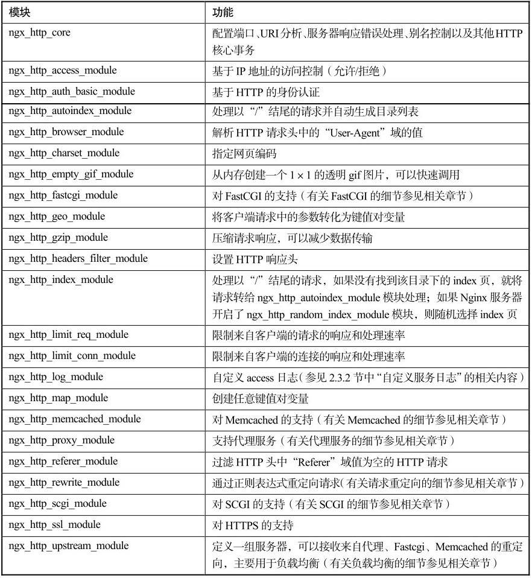
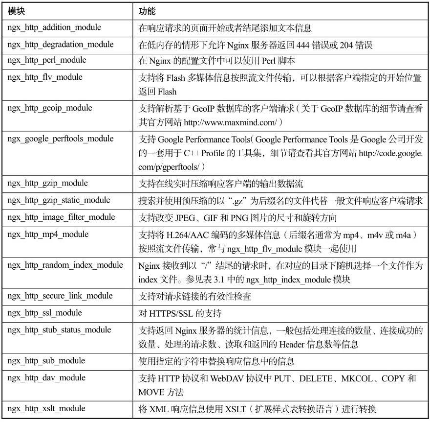

# Nginx模块化结构

在前面相关章节中多次提到了Nginx的模块。习惯上将Nginx涉及到的模块分为核心模块、标准HTTP模块、可选HTTP模块、邮件服务模块以及第三方模块等五大类。

核心模块是指Nginx服务器正常运行必不可少的模块，它们提供了Nginx最基本最核心的服务，如进程管理、权限控制、错误日志记录等；标准HTTP模块是通过第2章介绍的方法快速编译Nginx后包含的模块，其支持Nginx服务器的标准HTTP功能；可选HTTP模块主要用于扩展标准的HTTP功能，使其能够处理一些特殊的HTTP请求；邮件服务模块主要用于支持Nginx的邮件服务；第三方模块是为了扩展Nginx服务器应用，完成特殊功能而由第三方机构或者个人编写的可编译到Nginx中的模块。Nginx的每个模块都基本符合单一职责原则，在具体环境中可以根据实际情况裁减和加入。

核心模块和标准HTTP模块在Nginx快速编译后就包含在Nginx中。在Linux系统中，将工作目录定位到第2章中编译Nginx-1.2.3的路径/Nginx_123/nginx-1.2.3下，可以看到objs目录。objs目录中包含了这些内容：
```
# ls objs/
Makefile  autoconf.err  nginx  nginx.8  ngx_auto_config.h  ngx_auto_headers.h
ngx_modules.c  ngx_modules.o  src
在此目录中的ngx_modules.c文件中包含了此版本Nginx快速编译后包括的所有固有模块的声明。这些模块声明以extern关键字修饰：
```

```
# cat ngx_modules.c|grep extern|cat -n

extern ngx_module_t  ngx_core_module;
extern ngx_module_t  ngx_errlog_module;
extern ngx_module_t  ngx_conf_module;
extern ngx_module_t  ngx_events_module;
extern ngx_module_t  ngx_event_core_module;
extern ngx_module_t  ngx_epoll_module;
extern ngx_module_t  ngx_regex_module;
extern ngx_module_t  ngx_http_module;
extern ngx_module_t  ngx_http_core_module;
extern ngx_module_t  ngx_http_log_module;
extern ngx_module_t  ngx_http_upstream_module;
extern ngx_module_t  ngx_http_static_module;
extern ngx_module_t  ngx_http_autoindex_module;
extern ngx_module_t  ngx_http_index_module;
extern ngx_module_t  ngx_http_auth_basic_module;
extern ngx_module_t  ngx_http_access_module;
extern ngx_module_t  ngx_http_limit_conn_module;
extern ngx_module_t  ngx_http_limit_req_module;
extern ngx_module_t  ngx_http_geo_module;
extern ngx_module_t  ngx_http_map_module;
extern ngx_module_t  ngx_http_split_clients_module;
extern ngx_module_t  ngx_http_referer_module;
extern ngx_module_t  ngx_http_rewrite_module;
extern ngx_module_t  ngx_http_proxy_module;
extern ngx_module_t  ngx_http_fastcgi_module;
extern ngx_module_t  ngx_http_uwsgi_module;
extern ngx_module_t  ngx_http_scgi_module;
extern ngx_module_t  ngx_http_memcached_module;
extern ngx_module_t  ngx_http_empty_gif_module;
extern ngx_module_t  ngx_http_browser_module;
extern ngx_module_t  ngx_http_upstream_ip_hash_module;
extern ngx_module_t  ngx_http_upstream_least_conn_module;
extern ngx_module_t  ngx_http_upstream_keepalive_module;
extern ngx_module_t  ngx_http_write_filter_module;

extern ngx_module_t  ngx_http_header_filter_module;
extern ngx_module_t  ngx_http_chunked_filter_module;
extern ngx_module_t  ngx_http_range_header_filter_module;
extern ngx_module_t  ngx_http_gzip_filter_module;
extern ngx_module_t  ngx_http_postpone_filter_module;
extern ngx_module_t  ngx_http_ssi_filter_module;
extern ngx_module_t  ngx_http_charset_filter_module;
extern ngx_module_t  ngx_http_userid_filter_module;
extern ngx_module_t  ngx_http_headers_filter_module;

extern ngx_module_t  ngx_http_copy_filter_module;
extern ngx_module_t  ngx_http_range_body_filter_module;
extern ngx_module_t  ngx_http_not_modified_filter_module;
```

由于使用extern关键字修饰，因此各模块均可以被其他模块访问。

这里简要说明一下Nginx中模块的命名习惯。一般以ngx_作为前缀，_module作为后缀，中间使用一个或者多个英文单词描述模块的功能。比如ngx_core_module，中间的core表明该模块提供了Nginx程序的核心功能；再如ngx_events_module，中间的events表明该模块提供了解析配置文件中events块的功能；再如ngx_http_core_module，中间的http_core表明该模块提供了Nginx程序http服务的核心功能，等等。了解了Nginx中模块的命名习惯，再阅读上面列出的模块，就可以大致了解Nginx服务器在发布时能提供的主要服务了。

所有固有模块的源码放在编译目录下的src目录中。在src目录中，我们看到一共分成了core、event、http、mail、misc和os等6个目录。从这里看到，源码中包含了邮件服务的模块，但在快速编译时默认不将其编译到Nginx中。

##  1.核心模块
3.1.2小节加粗部分的模块提供Nginx的核心功能。详细来说，核心模块主要包含对两类功能的支持，一类是主体功能，包括进程管理、权限控制、错误日志记录、配置解析等，另一类是用于响应请求事件必需的功能，包括事件驱动机制、正则表达式解析等。

## 2.标准HTTP模块
在第1章中，我们提到Nginx服务器主要提供基本HTTP服务、高级HTTP服务和邮件服务等。这一模块对应于基本HTTP服务。

这些模块在默认情况下是被编译到Nginx中的，除非在配置时添加--without-XXX参数声明不编译。在表3.1中，笔者对上面列表中比较重要的标准HTTP模块进行了梳理并添加了说明，方便读者查询和理解。


<center>常用标准HTTP模块</center>

对于其他未涉及的标准HTTP模块，有兴趣的读者可以访问Nginx的官方网站查找相关内容。

## 3.可选HTTP模块
可选HTTP模块在目前的Nginx发行版本中只提供源码，但在快速编译时默认不编译。如果想使用相关模块，就必须在配置时使用--with-XXX参数声明。

在表3.2中，笔者对常见的可选HTTP模块进行了整理和说明，便于读者查询。


<center>常用可选HTTP模块</center>

## 邮件服务模块
在第1章中提到，邮件服务是Nginx服务器提供的主要服务之一。但是在目前的Nginx发行版本中，快速编译时默认并不会编译邮件服务模块。

和Nginx服务器提供的邮件服务相关的模块有：
- ngx_mail_core_module
- ngx_mail_pop3_module
- ngx_mail_imap_module
- ngx_mail_smtp_module
- ngx_mail_auth_http_module
- ngx_mail_proxy_module
- ngx_mail_ssl_module

这些模块完成了邮件服务的主要功能，包括对POP3协议、IMAP协议和SMTP协议的支持，对身份认证、邮件代理和SSL安全服务的提供。

## 第三方模块

由于Nginx支持自定义模块编程，第三方模块不断得到扩充，功能也非常丰富。目前，记录在wiki站点的就多达90个，而且还有一些模块是没有包含在内的。对于繁多的第三方模块，我们不打算在这里一一列举，读者可以根据自己的需要从wiki站点自行查找。

在第三方模块的开发作者中，深受广大Nginx用户推崇的要算是一位笔名为agentzh的工程师了。他开发的echo-nginx-module模块（支持在Nginx配置文件中使用echo、sleep、time及exec等类Shell命令）、memc-nginx-module模块（对标准HTTP模块ngx_http_memcached_module的扩展，支持set、add、delete等更多的命令）、rds-json-nginx-module模块（使Nginx支持Json数据的处理）、lua-nginx-module模块（使Nginx支持lua脚本语言）等都是笔者在日常工作中经常使用的。有兴趣的读者可以到wiki站点下载使用。

到此，我们介绍完了Nginx的五大类模块，大家对前面四种包含的具体模块及其功能有了比较清晰的认识。从前面的内容我们能够看出，Nginx服务器在功能定制和扩展上具有其他Web服务器无法媲美的巨大优势，从核心功能到一般功能，再到扩展功能，几乎都可以使用“模块化”技术实现。

那么，这些模块彼此是如何组织在一起，为Nginx服务器提供支持的呢？从下一节开始，我们更进一步从Nginx服务器的设计架构出发，来全面了解各个模块之间的联系。