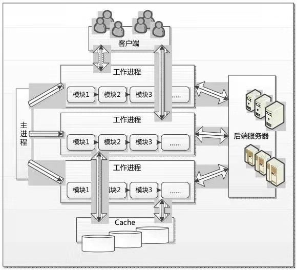

# Nginx服务器架构

Nginx服务器启动后，产生一个主进程（master process），主进程执行一系列工作后产生一个或者多个工作进程（worker processes）。主进程主要进行Nginx配置文件解析、数据结构初始化、模块配置和注册、信号处理、网络监听生成、工作进程生成和管理等工作；工作进程主要进行进程初始化、模块调用和请求处理等工作，是Nginx服务器提供服务的主体。

在客户端请求动态站点的过程中，Nginx服务器还涉及和后端服务器的通信。Nginx服务器将接收到的Web请求通过代理转发到后端服务器，由后端服务器进行数据处理和页面组织，然后将结果返回。

另外，Nginx服务器为了提高对请求的响应效率，进一步降低网络压力，采用了缓存机制，将历史应答数据缓存到本地。在每次Nginx服务器启动后的一段时间内，会启动专门的进程对本地缓存的内容重建索引，保证对缓存文件的快速访问。

根据上面的分析，我们可以将Nginx服务器的结构大致分为主进程、工作进程、后端服务器和缓存等部分。图3.2展示了各个部分之间的联系和交互。

Nginx服务器架构示意图

在该示意图中，有几个方面的内容我们需要重点阐述，包括Nginx服务器的进程、进程交互和Run-Loop事件处理循环机制等。