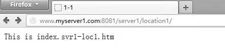
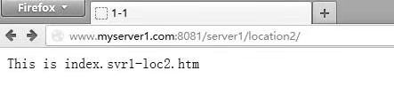

# 测试myServer1的访问

在用户端浏览器中输入“myserver1:8081/svr1/location1/”，可以看到网站页面的显示如图2.3所示，这说明主机访问正常，也表明配置文件实例中45～46行及54～58行的配置正确。

同样，在用户端浏览器地址中输入“myserver1:8081/server1/location2/”，则可以看到网站页面的显示如图2.4所示。

图2.3 访问myServer1（请求location1）

图2.4 访问myServer1（请求location2）

## 注意

为了能够以主机名的方式访问站点，我们需要配置自己的DNS服务器，使得浏览器能够根据输入的域名地址（myserver1）查找到对应的IP地址（192.168.1.3）。