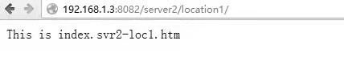
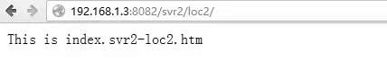
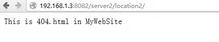

# 测试myServer2的访问

在用户端浏览器中输入`192.168.1.3:8082/server2/location1/`，可以看到网站页面的显示如图2.5所示，这说明主机访问正常，也表明配置文件实例中69～70行及75～78行的配置正确。

图2.5 访问myServer2（请求location1）

在用户端浏览器中输入`192.168.1.3:8082/svr2/loc2/`，则可以看到网站页面的显示如图2.6所示，这说明主机访问正常，也表明配置文件实例中80～83行对location块的URI路径更改生效。

图2.6 访问myServer2（请求location2）

如果在用户浏览器中输入`http://192.168.1.3:8082/server2/location2/`，由于使用location块对URL路径做了更改，导致无法找到网页，Nginx服务器返回404错误消息，如图2.7所示。404错误的页面是笔者自己定义的，这说明配置文件实例中85～89行对404错误页面的定向生效。

图2.7 返回自定义的错误页面
