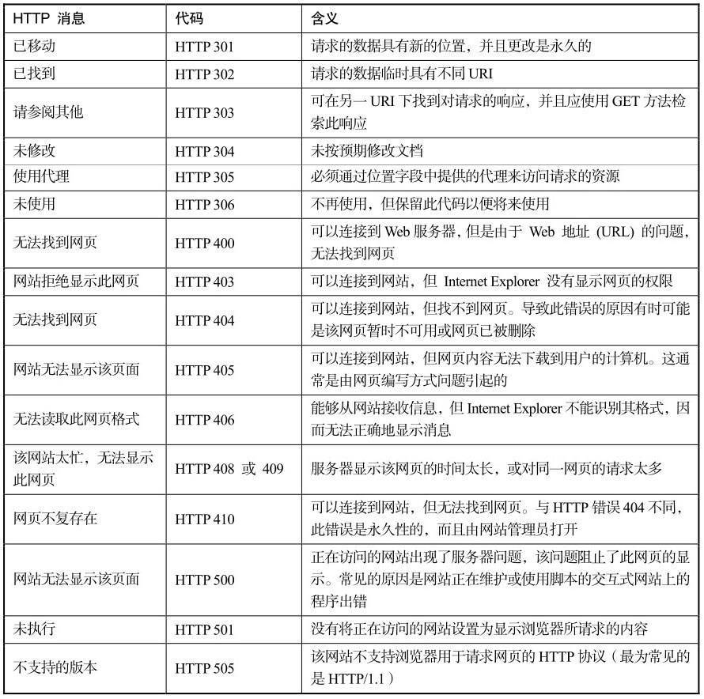

# 设置网站的的错误首页

如果用户端尝试查看网页时遇到问题，服务器会将HTTP错误从网站发送到Web浏览器。如果无法显示网页，Web浏览器会显示网站发送的实际错误网页或Web浏览器内置的友好错误消息。Nginx服务器支持自定义错误网页的显示内容。可以通过这一功能在网站发生错误时为用户提供人性化的错误显示页面。

一般来说，HTTP 2XX代表请求正常完成，HTTP 3XX代表网站重定向，HTTP 4XX代表客户端出现错误，HTT 5XX代表服务器端出现错误。笔者在Microsoft的官方网站查找到一些常见HTTP错误的说明，整理在表2.3中，方便读者查询。

<center>表2.3 常见的HTTP错误</center>



Nginx服务器设置网站错误页面的指令为error_page，语法结构为：
```
    error_page code ... [=[response]] uri
```
- code，要处理的HTTP错误代码，常见的在表2.2中已经列出。
- response，可选项，将code指定的错误代码转化为新的错误代码response。
- uri，错误页面的路径或者网站地址。如果设置为路径，则是以Nginx服务器安装路径下的html目录为根路径的相对路径；如果设置为网址，则Nginx服务器会直接访问该网址获取错误页面，并返回给用户端。

看几个error_page指令的示例：
```
    error_page 404 /404.html
```
设置Nginx服务器使用“Nginx安装路径/html/404.html”页面响应404错误（“无法找到网页”错误）。再如：
```
    error_page 403 http://somewebsite.com/forbidden.html;
```
设置Nginx服务器使用`http://somewebsite.com/forbidden.html`页面响应403错误（“拒绝显示网页”错误）。再如：
```
error_page 410 =301 /empty.gif
```
设置Nginx服务器产生410的HTTP消息时，使用“Nginx安装路径/html/empty.gif”返回给用户端301消息（“已移动”消息）。

在前面对error_page指令的分析中我们看到，变量uri实际上是一个相对于Nginx服务器安装路径的相对路径。那么，如果不想将错误页面放到Nginx服务器的安装路径下管理，该怎么做呢？

其实这个很简单，只需要另外使用一个location指令定向错误页面到新的路径下面了就可以了。比如对于上面的第一个示例，我们希望Nginx服务器使用“/myserver/errorpages/404.html”页面响应404错误，那么在设置完：
```
    error_page 404 /404.html
```
之后，我们再添加这样一个location块：
```
    location /404.html
    {
        root /myserver/errorpages/
    }
```
首先捕获“/404.html”请求，然后将请求定向到新的路径下面即可。
errer_page指令可以在http块、server块和location块中配置。