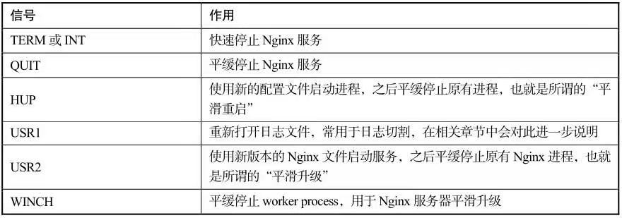

# Nginx服务的信号控制

在Nginx服务的启停办法中，有一类是通过信号机制来实现的，因此，我们先来介绍一下Nginx服务器的信号控制。

Nginx服务在运行时，会保持一个主进程和一个或多个worker process工作进程。我们通过给Nginx服务的主进程发送信号就可以控制服务的启停了。那么，如何给主进程发送信号呢？首先要知道主进程的进程号PID。

获取PID有两个途径。一个是，在Nginx服务启动以后，默认在Nginx服务器安装目录下的logs目录中会产生文件名为nginx.pid的文件，此文件中保持的就是Nginx服务主进程的PID。这个文件的存放路径和文件名都可以在Nginx服务器的配置文件中进行配置，我们在下一节中可以看到详细过程。
当前笔者的Nginx服务主进程PID为4136：
```
# cat nginx.pid
4136
```
第二个获取Nginx服务主进程PID的办法是使用Linux平台下查看进程的工具ps，使用方法是：
```
# ps -ef | grep nginx
root        4136    1   0 01:05 ?       00:00:00 nginx: master process ./nginx
nobody      4137  4136   0 01:05 ?       00:00:00 nginx: worker process
nobody      4138  4136   0 01:05 ?       00:00:00 nginx: worker process
nobody      4139  4136   0 01:05 ?       00:00:00 nginx: worker process
root        4360  4062   0 02:44 pts/0   00:00:00 grep Nginx
```

从运行命令的结果来看，系统中包含一个Nginx服务的主进程master process和三个工作进程worker process，其中主进程对应的PID为第二列中的4136，这和nginx.pid文件中的一致。

Nginx服务主进程能够接收的信号如表2.2所列。

<center>表2.2 Nginx服务可接收的信号<center>



向Nginx服务主进程发送信号也有两种方法。一种是使用nginx二进制文件，在下一小节中说明；另一种方法是使用kill命令发送信号，其用法是：
```
kill SIGNAL PID
```
- SIGNAL，用于指定信号，即指定表2.2中的某一个。
- PID，指定Nginx服务主进程的PID，也可以使用nginx.pid动态获取PID号：

```
    kill SIGNAL `filepath`
```
其中，filepath为nginx.pid的路径

