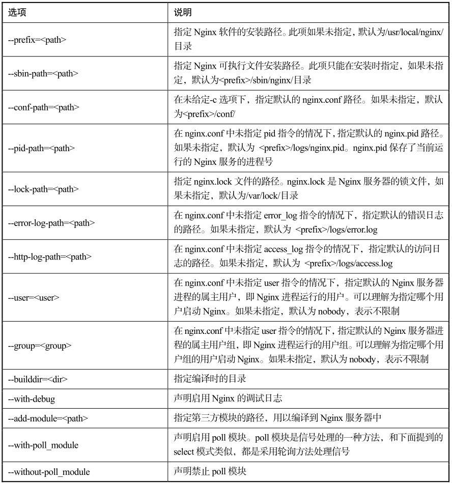
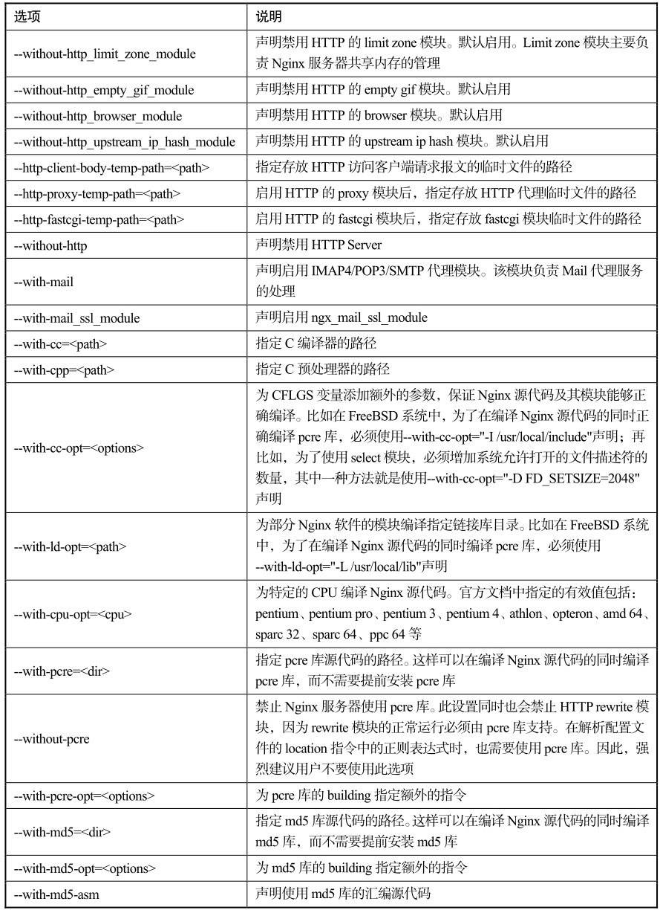
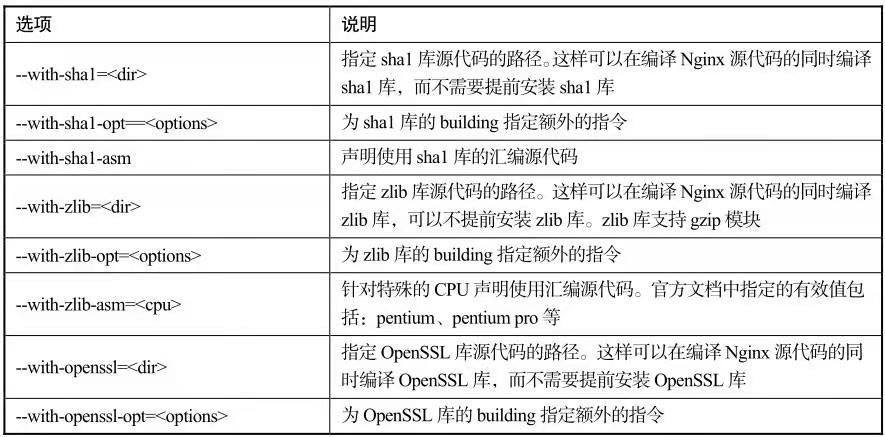

# Linux版本的编译和安装-Nginx软件的自动脚本

为了方便管理和使用，我们在文件系统的根目录“/”下新建Nginx_123目录，最后会把编译好的Nginx安装到此目录中。同时，在此目录中新建Nginx_123_ Compile，用来编译Nginx软件：
```
mkdir /Nginx_123/
```
将2.1节中获取的Linux版本的nginx-1.2.3.tar.gz复制到对应目录：
```
cp nginx-1.2.3.tar.gz /Nginx_123/
```

解压Nginx归档，得到Nginx软件安装包的所有资源：
```
tar xf nginx-1.2.3.tar.gz                                     
```    

```
cd /Nginx_123/nginx-1.2.3
ls -l
总用量 572
drwxr-xr-x. 6 1001 1001  4096 1月  7 10:45 auto
-rw-r--r--. 1 1001 1001 212690 11月 13 21:36 CHANGES
-rw-r--r--. 1 1001 1001 324135 11月 13 21:36 CHANGES.ru
drwxr-xr-x. 2 1001 1001  4096 1月  7 10:45 conf
-rwxr-xr-x. 1 1001 1001  2369 8月  7 2012 configure
drwxr-xr-x. 3 1001 1001  4096 1月  7 10:45 contrib
drwxr-xr-x. 2 1001 1001  4096 1月  7 10:45 html
-rw-r--r--. 1 1001 1001  1397 8月  6 2012 LICENSE
-rw-r--r--. 1 root root   374 1月  7 14:48 Makefile
drwxr-xr-x. 2 1001 1001  4096 1月  7 10:45 man
drwxr-xr-x. 3 root root  4096 1月  7 14:48 objs
-rw-r--r--. 1 1001 1001    49 10月 31 2011 README
drwxr-xr-x. 8 1001 1001  4096 1月  7 10:45 src
```

同样，为了方便后续的学习，我们有必要对解压出来的部分文件和目录做个简单的介绍。

- src目录中存放了Nginx软件的所有源代码。本书的第二篇“Nginx进阶”会对其做详细的介绍。
- man目录中存放了Nginx软件的帮助文档，Nginx安装完成后，在Fedora的命令行中使用man命令可以查看：
```
man nginx
```

- html目录和conf目录中存放的内容和Windows版本的同名目录相同。
- auto目录中存放了大量脚本文件，和configure脚本程序有关。
- configure文件是Nginx软件的自动脚本程序。有过Linux软件编译经验的朋友应该对configure自动脚本程序有所了解。运行configure自动脚本一般会完成两项工作：一是检查环境，根据环境检查结果生成C代码；二是生成编译代码需要的Makefile文件。

进入auto目录，我们可以看到各种脚本资源。这些脚本职能划分清晰，有的检查环境（如os目录下的脚本），有的检查模块（如modules脚本），有的处理脚本参数（如options脚本），有的是用来输出信息到生成文件的（如have、nohave、make及install等），还有的是为自动脚本本身服务（如feature脚本）的。前面已经提到，Nginx软件的自动脚本是作者手工编写的，如果你在工作中需要编写自动脚本或者希望学习相关的内容，这个目录下的文件具有很高的参考价值。这些脚本文件没有涉及生僻的用法，可以仔细研究一下，在这里就不再赘述了。

CHANGES文件、LICENSE文件、README文件和Windows版本docs目录下存放的同名文件相同。

Nginx源代码的编译需要现使用configure脚本自动生成Makefile文件。在介绍生成Makefile文件操作之前，我们先介绍一下configure脚本支持的常用选项（见表2.1）。

<center>config脚本常用选项<center>









了解了configure支持的常用选项后，就可以根据自己的实际情况使用configure脚本自动生成Makefile文件了。

将当前工作路径定位到/Nginx_123/Nginx_123_Compile/nginx-1.2.3/目录之后，笔者在自己的Fedora系统中，使用以下命令配置并生成Makefile文件：
```
./configure --prefix=/Nginx                                     //
编译配置
```
--prefix指定了Nginx软件的安装路径为之前新建的Nginx目录。
其他的设置使用默认设置。

按Enter键运行命令，可以在屏幕上看到configure自动脚本运行的全过程。在运行过程中，configure脚本调用auto目录中的各种脚本对系统环境以及相关的配置和设置进行了检查。

注意
>生成的Nginx软件的Makefile文件就保存在当前的工作目录，即/Nginx_123/Nginx_123_Compile/nginx-1.2.3/中，可以使用ls指令查询。这里使用了最基本的Nginx配置。我们将在后文中逐渐增加对Nginx服务器的功能需求，指定的configure选项也将逐渐增加。