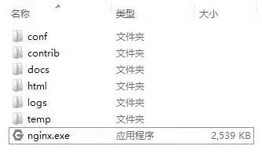

# Windows版本的安装

Windows版本的Nginx服务器安装方法与一般的Windows安装程序有所不同。
我们获取的Windows版本Nginx服务器安装文件为nginx-1.2.3.zip压缩文件。安装Windows版本的Nginx服务器不需要进行特殊的安装操作，使用解压工具解压此压缩文件后，得到如图2.2所示的文件资源，这就是nginx服务器运行的全部资源。

Windows版本Nginx的安装文件资源

Windows版本的Nginx服务器在效率上比Linux版本要差一些，并且Nginx在实际使用中一般用在Linux/Unix系统中，本文以Nginx 1.2.3版为学习重点进行说明。但为了方便后续的学习，我们还是有必要对解压出来的部分文件和目录做简单的介绍。

- conf目录中存放的是Nginx服务器的配置文件，包含Nginx服务器的基本配置文件和对部分特性的配置文件。在本节的后文中，我们将重点介绍名为nginx.conf的配置文件如何使用。正确配置此文件可以保证Nginx服务器的正常运行。其他配置文件将在后续相关章节中陆续提及。

- docs目录中存放了Nginx服务器的文档资料，包含Nginx服务器的LICENSE、OpenSSL的LICENSE、PCRE的LICENCE以及zlib的LICENSE，还包括本版本Nginx服务器升级的版本变更说明，以及README文档。如果想了解Nginx服务器的具体细节，可以访问Nginx的官方网站[http://www.nginx.org](http://www.nginx.org)。另外，[http://wiki.nginx.org/Main](http://wiki.nginx.org/Main)也是了解Nginx服务器相关信息的不错网站。

- html目录中存放了两个后缀名为.html的静态网页文件。这两个文件与Nginx服务器的运行相关，在后面介绍Nginx启动时将介绍这两个文件，在此不再赘述。

- logs目录中存放了Nginx服务器的运行日志文件。我们将在讲述Nginx服务器配置时介绍它的日志功能，那里会涉及本目录的使用，在此也不再赘述。

- nginx.exe即为启动Nginx服务器的运行程序。如果conf目录下的nginx.conf文件配置正确，通过它即可完成nginx服务器的启动操作。